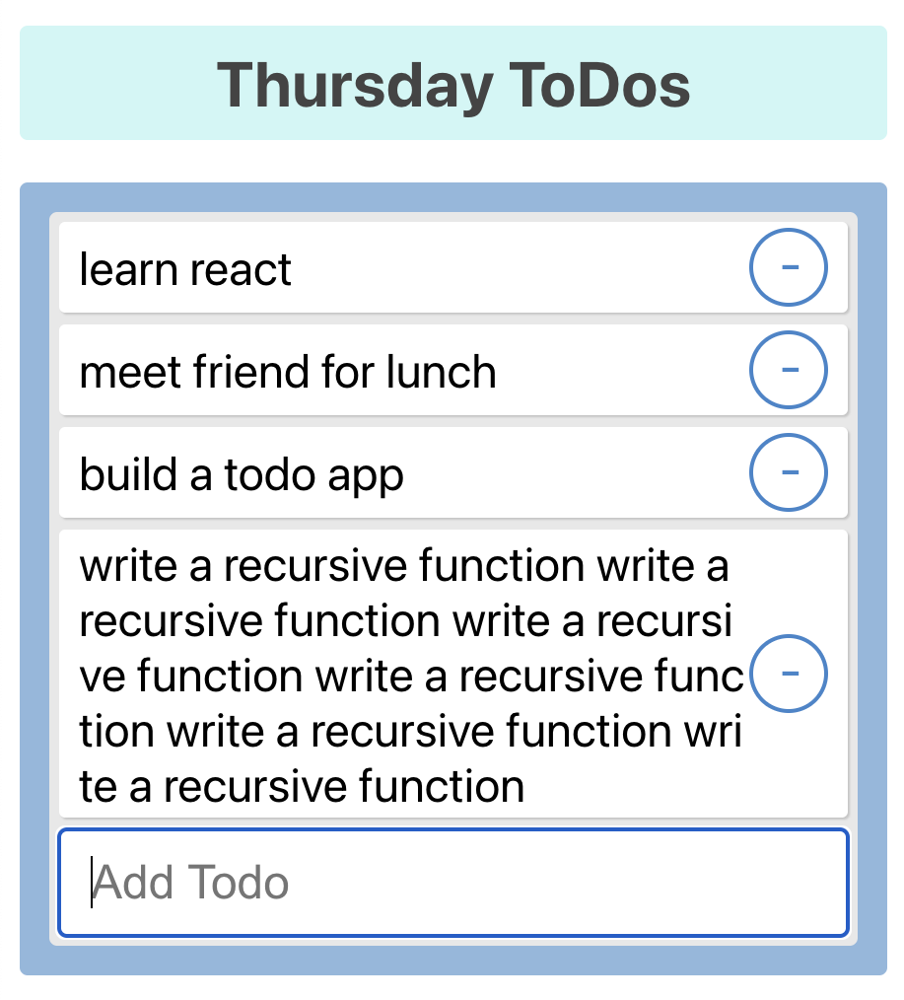

# ToDo List created with React

## This is a functioning To Do list application built with React

#### How to run: 
- clone this repository / download it to your computer
- the app is running on React CDN so no need to instal node modules!
- if you don't have http-server installed open the command line
- npm install -- global hhtp-server
- cd into the folder with this project 
- http-server -c-1
- navigate to http://localhost:8080/ in your browser
- add items to your ToDo list
- click on an item to remove it  

#### This app was created as a part of the MITxPro Professional Certificate in Coding course
#### with specific instructions on how to build it. My contributions were: 
- Color scheme
- styling of the remove button
- text break feature (pictured above)
- day of the week displayed in the header

### Future Improvements
The list resets with every page refresh. In the future, I will add a database to store each entry and have it rendered until it is deleted by the user

MIT License 
